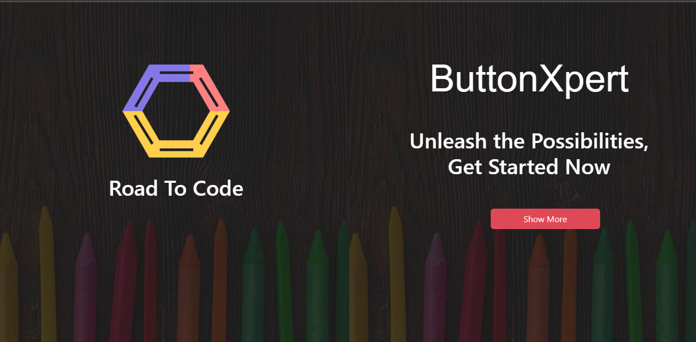
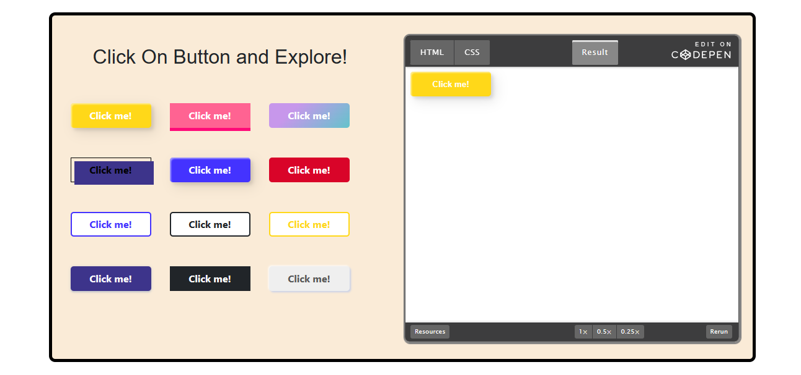

# buttonXpert

  

The goal of the `ButtonXpert` project is to provide a convenient tool for developers and designers to quickly create buttons without the need for complex coding. 

The ButtonXpert project is built using `React` which allows users to create buttons with different styles.

Users can easily customize the button by adjusting properties such as size, color, border and hover effect.

Once the button design is created users can click a button to copy the HTML and CSS code to the clipboard, making it convenient for them to use the button style in their projects. These application is responsive.

Technologies are used in the project are `React` and `CSS`.

`React :` For building the user interface and handling button state changes.

`CSS :` To style the button and create the live preview.

